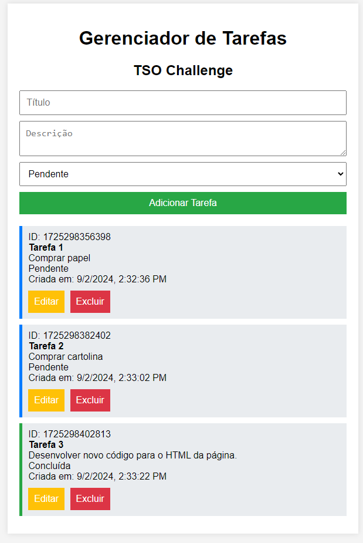
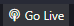

# TSO CHALLENGE - Gerenciador de Tarefas

Requisitos
==========
- Um navegador Web - Chrome, Firefox, Opera
- Realizar o download do arquivo do projeto em ZIP

### OPCIONAL

- Realizar o download do Live Server e executar o index.html via live server para Visual Studio Code: https://marketplace.visualstudio.com/items?itemName=ritwickdey.LiveServer

Funcionamento
=============

- Ao realizar o download do arquivo ```.zip```, extraia para uma pasta de sua preferência e execute o arquivo ```index.html``` dentro da pasta ```html```.

- Onde visualizará uma tela como essa, podendo adicionar, remover ou editar tarefas, cada uma com seu específico ID:


- Ao recarregar a página ```F5``` ou ```CTRL+F5``` note que as tarefas ainda permanecem lá, permitindo a edição e visualização por ID.

- Caso queira executar via Live Server, abra a pasta que extraiu o projeto no Visual Studio Code, navegue até o diretório ```html```, selecione o ```index.html``` e por fim execute o Live Server clicando no botão da extensão. 

Decisões tomadas
================

- Optei por usar o localStorage para este caso para exemplificar o uso da solução mesmo offline.

- Tive certa dificuldade de realizar o backend portanto segui com o localStorage.